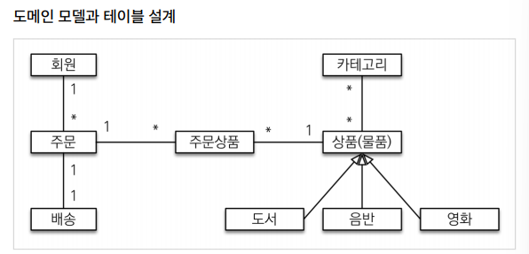
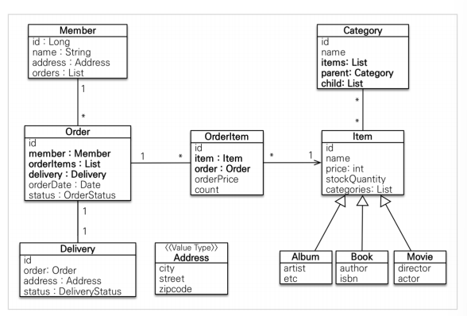
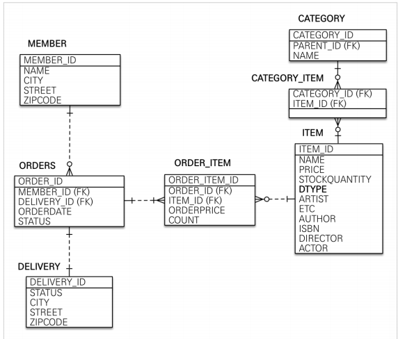

## JPA 활용 1편 - Book Store

--------------------
도메인 모델

엔티티 설계

테이블 설계

---------------------

### Member 엔티티, 레포지토리, 서비스 개발 + 테스트 

1. Member 엔티티 

@Entity
* city, street, zipcode는 Delivery 엔티티와 중복되는 코드 이므로 임베디드 타입으로 선언함.
* Order 엔티티와 일대다 연관관계 매핑함.

2. Member 레포지토리

@Repository

@PersistenceContext 
* save(): persist() 메서드를 통해 엔티티를 영속성 컨텍스트로 만든다. 
* findOne(): find() 메서드를 통해 특정 아이디를 찾는다. 
* findAll(): JPQL 쿼리를 사용해 회원 전체를 조회한다. 
* findByName(): JPQL 쿼리를 사용해 회원 이름으로 정보를 조회한다. 

* setParameter(): ':name' 의 값은 setParameter("name", name) 메서드를 통해서 쿼리에 값을 전달한다. 
* getResultList(): 쿼리의 실행 결과를 List 형식으로 가져오는 역할을 한다. 
3. Member 서비스

@Service

@Transactional(readOnly = true)
* join(): 회원 가입 진행
* validateDuplicateMember(): 중복 회원 검증
* findMembers(): 전체 회원 조회
* findOne(): id로 특정 회원 조회 

* 생성자 주입: 변경 불가능한 안전한 객체를 생성할 수 있다. @RequiredArgsConstructor 어노테이션을 사용하면 생성자를 직접 작성하지 않아도 된다. 

4. MemberRepositoryTest

* 회원가입, 중복회원체크, 회원조회(findOne)

-------------------------
