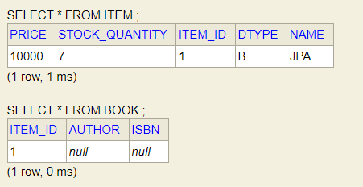
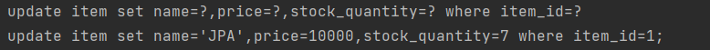
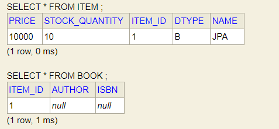
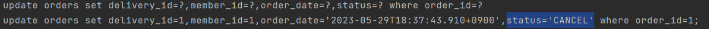
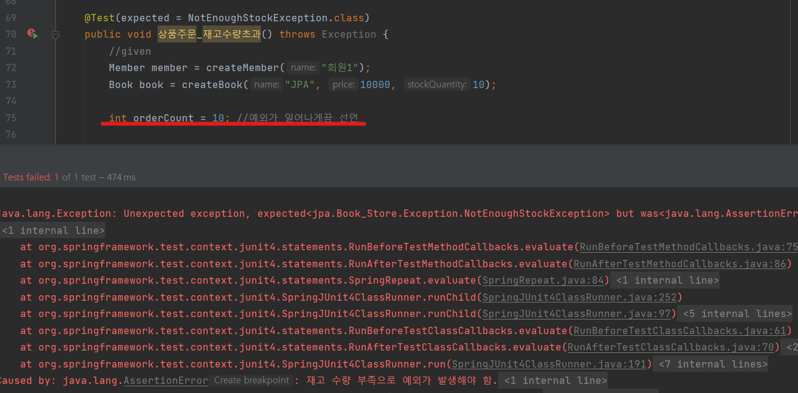

## JPA 활용 1편 - Book Store

--------------------
도메인 모델

엔티티 설계

테이블 설계

---------------------

### Member 엔티티, 레포지토리, 서비스 개발 + 테스트 

1. Member 엔티티 

@Entity
* city, street, zipcode는 Delivery 엔티티와 중복되는 코드 이므로 임베디드 타입으로 선언함.
* Order 엔티티와 일대다 연관관계 매핑함.

2. Member 레포지토리

@Repository

@PersistenceContext 
* save(): persist() 메서드를 통해 엔티티를 영속성 컨텍스트로 만든다. 
* findOne(): find() 메서드를 통해 특정 아이디를 찾는다. 
* findAll(): JPQL 쿼리를 사용해 회원 전체를 조회한다. 
* findByName(): JPQL 쿼리를 사용해 회원 이름으로 정보를 조회한다. 

* setParameter(): ':name' 의 값은 setParameter("name", name) 메서드를 통해서 쿼리에 값을 전달한다. 
* getResultList(): 쿼리의 실행 결과를 List 형식으로 가져오는 역할을 한다. 
3. Member 서비스

@Service

@Transactional(readOnly = true)
* join(): 회원 가입 진행
* validateDuplicateMember(): 중복 회원 검증
* findMembers(): 전체 회원 조회
* findOne(): id로 특정 회원 조회 

* 생성자 주입: 변경 불가능한 안전한 객체를 생성할 수 있다. @RequiredArgsConstructor 어노테이션을 사용하면 생성자를 직접 작성하지 않아도 된다. 

4. MemberRepositoryTest

* 회원가입, 중복회원체크, 회원조회(findOne)

-------------------------

### Item 엔티티, 레포지토리, 서비스  + 테스트

1. Item 엔티티

@Inheritance(strategy = InheritanceType.JOINED) 

* 조인전략으로 Book, Album, Movie 엔티티를 각각의 테이블을 만들어 필요 시 조인해서 사용함. 

@DiscriminatorColumn(name = "dtype")

* 부모 엔티티 클래스의 구분 컬럼을 설정하는데 사용됨. 
* 해당 어노테이션을 사용하여 테이블에 구분 컬럼을 추가하고, 각각의 엔티티가 어떤 자식 클래스를 나타내는지 식별함. 

비지니스 로직

* addStock(): 상품의 재고를 추가함. (주문 취소시 원래 재고로 돌아노는 기능)
* removeStock(): 상품의 재고를 줄임. (주문 접수시 주문 수량 만큼 재고를 줄인다.)

2. Item 레포지토리

* save(): 해당 상품이 없다면 추가하고, 이미 존재한다면 병합한다. (-> 추구 변경감지 기능으로 변경 예정!)
* findOne(): 상품 ID로 특정 상품을 찾음.
* findAll(): JPQL 쿼리문을 사용해서 등록된 상품 전체를 찾음.

3. Item 서비스

레포지토리에 작선한 메서드를 통해 상품을 등록하고 찾는 서비스를 제공함. 

4. Item 테스트

ItemRepository, ItemService를 주입받아 테스트 진행

일단은 상품을 추가하는 테스트만 진행함. 

* Book 상품을 생성하고, 이 상품을 등록함. 

* 추가한 Book 상품을 조회.

* 추가한 Item 전체 조회.

--------------------

### Order, OrderItem 엔티티, 레포지토리, 서비스 + 테스트 

1. Order 엔티티
* 생성 메서드(createOrder()) : 주문회원, 배송정보, 주문상품의 정보를 가지고 실제 주문 엔티티를 생성함.
* 주문 취소(cancel()) : 주문상태를 취소로 변경하고 주문상품에 주문취소를 알림. 만약 이미 배송완료된 상품일 경우 주문취소를 못 하도록 예외처리
* 전체 주문 가격 조회(getTotalPrice()) : 주문상품의 가격을 조회해서 모두 더한 값을 반환함. 

2. OrderItem 엔티티
* 생성 메서드(createOrderItem()) : 주문회원, 배송정보, 주문상품의 정보를 가지고 실제 주문 상품 엔티티를 생성함, removeStock() 메서드를 호출해서 주문한 수량만큼 재고를 줄임.
* 주문 취소(cancel()) : addStock() 메서드를 호출해서 취소 수량만큼 증가시킴.
* 주문 가격 조회(getTotalPrice()) : 주문 수량에 주문 가격을 곱한 값을 반환함.

3. Order 레포지토리
* 주문 엔티티를 저장(save)하고 조회(findOne)하는 기능이 있음. 

4. Order 서비스 
* 주문 엔티티와 주문 상품 엔티티의 비즈니스 로직을 활용해 주문, 주문 취소, 주문 내역 검색 기능을 제공함. 
* 주문(order()) : 주문 회원 식별자, 상품 식별자, 주문 수량 정보를 받아 실제 주문 엔티티를 생성한 후 저장함. 
* 주문 취소(cancelOrder()) : 주문 식별자를 받아서 주문 엔티티를 조회한 후 주문 엔티티에 주문 취소를 요청함. 

<참고> 도메인 모델 패턴 : 엔티티가 비즈니스 로직을 가지고 객체 지향의 특성을 적극 활용하는 것을 말한다. 
서비스 계층은 단순히 엔티티에 필요한 요청을 위임하는 역할을 하기 때문에, 엔티티가 비즈니스 로직을 가지고 있는 것이 바람직하다. 

5. Order 테스트
* 상품주문() : 주문회원, 주문상품, 주문수량 등 테스트를 위한 정보 생성하고, 상품 주문 후 주문 상태가 올바른지 주문가격, 수량등이 올바른지 확인함.

* 주문취소() : 주문을 하고 취소한 뒤, 주문상태가 CANCEL로 변경되었는지 재고가 원래대로 돌아왔는지 확인.

* 상품주문_재고수량초과() : 재고수량보다 많은 양의 상품을 주문할 경우 예외가 발생함.

orderCount = 11 일 경우 예외가 발생해 then절로 넘어가 fail이 실행되지만

orderCount = 10 일 경우 예상한 예외가 발생하지 않아 Test 메서드에 대한 예외가 발생함. 

----------------------

